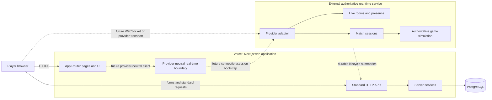
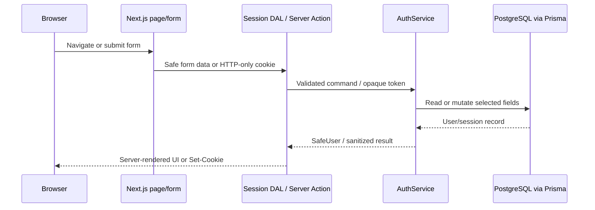

# TwoPlayer system architecture

## Status and scope

This document describes the architecture after Phase 2. The repository provides public discovery, permanent and guest sessions, profile/preferences, catalog reads, provider-neutral real-time contracts, configuration, persistence models, and presentation primitives. It still contains no presence, room, matchmaking, invitation, chat, voice, authoritative match-session, or gameplay flow.

The central architectural decision is to separate the Vercel-hosted web/control plane from a provider-agnostic, externally hosted authoritative real-time/data plane.

## Architectural drivers

- Support a catalog of games rather than coupling the platform to the first zombie shooter.
- Support two-player games now without preventing room capacities up to four players.
- Keep normal web workloads suitable for Vercel and PostgreSQL.
- Keep long-lived connections and authoritative simulation outside serverless request lifecycles.
- Make Colyseus, Nakama, Photon, or a custom server replaceable without rewriting page and component code.
- Keep durable history separate from high-frequency session state.
- Avoid premature services while keeping explicit ownership boundaries.

## System context



Dashed paths are future integrations. Phase 2 opens no real-time connection and runs no simulation. Solid HTTPS paths now cover server-rendered discovery, credential/session operations, profile updates, and preference updates.

## Responsibility boundaries

| Area                                         | Owner                           | Notes                                                                                  |
| -------------------------------------------- | ------------------------------- | -------------------------------------------------------------------------------------- |
| Marketing/site pages and product navigation  | Next.js on Vercel               | Home, catalog, game briefs, responsive shell, and deliberate UX states.                |
| Account/profile presentation                 | Next.js on Vercel               | Login, registration, guest continuation, profile, settings, and auth-aware navigation. |
| Standard APIs and Server Actions             | Next.js on Vercel               | Validated request/response work, session cookies, profile/preferences, and health.     |
| Authentication/session service               | Next.js on Vercel + PostgreSQL  | Replaceable service; hashed passwords and opaque-session digests in database mode.     |
| Durable platform records                     | PostgreSQL through Prisma       | Users, games, room metadata/membership, and match history.                             |
| Live room snapshots                          | External real-time service      | Authoritative during an active session.                                                |
| Online presence and connection state         | External real-time service      | Transient session state; no persistent `Presence` table.                               |
| Match session allocation and reconnect state | External real-time service      | Exposed through provider-neutral contracts.                                            |
| Game ticks and authoritative game state      | External real-time service      | Must not depend on a Vercel function staying alive.                                    |
| Movement, damage, and combat validation      | External real-time service      | Explicitly outside the browser and Vercel web process.                                 |
| Zombie, wave, boss, and encounter simulation | External real-time service      | Future gameplay phase only.                                                            |
| Telemetry export                             | Each runtime, later integration | Endpoint/DSN values remain server-only.                                                |

The browser is never authoritative for room membership, readiness, combat, progression, or match outcome. It renders snapshots and submits intents to whichever service owns that state.

## Application layers

```text
src/app
  Routes, layouts, route handlers, and framework-level loading/error states
       |
src/components
  Reusable UI primitives and composed presentation
       |
src/domain        src/realtime
  Pure models       Serializable contracts and gateway interface
       |                 |
src/server/actions       src/server/dal
  Validated mutations      Authorized request-scoped reads
             \             /
      src/server/auth     src/server/catalog
        Account/session     Catalog orchestration
       |
src/db            src/config
  Prisma access     Validated public/server configuration
```

Dependency guidelines:

- `src/domain` stays independent of React, Next.js, Prisma-generated types, and vendor SDKs.
- Pages compose components and invoke the catalog/DAL; they do not contain persistence, credential, or room business logic.
- Client modules may import only the explicitly public configuration module. They must not import server configuration or the database client.
- Database access is mechanically marked server-only and is owned by `src/db` plus server-side services. Client modules must never import that boundary.
- UI and application services depend on `RealtimeGateway`, never directly on a vendor SDK.
- A future vendor adapter may depend on its SDK but translates all inputs, outputs, events, and failures at the boundary.

## Phase 2 account and catalog flow



Passwords and raw session tokens never return from the DAL to presentation components. PostgreSQL stores a salted `scrypt` password hash and a SHA-256 session-token digest. Protected reads and actions authorize next to their data; the auth-aware header is presentation, not an authorization gate.

Catalog pages query `src/server/catalog`. Non-production development may use a deterministic typed catalog before PostgreSQL is seeded. Production never substitutes demo data for a failed database read: failure reaches route recovery UI, while an empty table reaches the empty-catalog state. Catalog data contains no online-player or presence values.

## Provider-neutral real-time boundary

`src/realtime` defines the vocabulary required by later phases without implementing it. The gateway covers:

- room creation;
- room joining and leaving;
- room-state subscription with explicit cleanup;
- player presence queries;
- match-session creation;
- disconnect handling; and
- reconnect using provider-neutral connection/session tokens.

Contracts use platform/domain identifiers and JSON-safe values. Timestamp fields use strings by ISO 8601 convention, but `IsoDateString` is not yet runtime-validated or branded. Contracts must not expose a provider room object, connection object, message class, transport code, or SDK-specific token shape.

The Phase 1 unconfigured adapter fails promise-returning commands with a typed `RealtimeUnavailableError`. `subscribeToRoom` is intentionally inert and returns a no-op cleanup without notifying its listener. This is a placeholder—not simulated room or presence behavior—and a later UI must not wait indefinitely for an event from the unconfigured adapter.

The boundary currently standardizes only the unavailable error. It has no operational error taxonomy or subscription error/completion channel. Provider error normalization, retryability, and subscription-failure semantics are Phase 3+ contract decisions.

`PresenceQuery` currently permits either optional `roomId`, optional `userIds`, both, or neither. Before a provider is implemented, define whether an empty query means all visible presence or is invalid; alternatively tighten the contract to a discriminated union.

### Provider replacement rule

Adding or replacing a provider should require only these changes:

1. Implement `RealtimeGateway` in a provider adapter.
2. Translate vendor events into platform contracts and implement the future error taxonomy/subscription failure policy.
3. Select/configure the adapter in a composition root.
4. Add adapter contract tests and deployment configuration.

Page components and shared UI should not change solely because the transport vendor changes. If a vendor feature cannot be represented by the platform contract, first decide whether it is a genuine product concept or merely provider-specific behavior.

## Durable and transient state

| State                                                   | Durable PostgreSQL record     | Live authoritative source                                                                   |
| ------------------------------------------------------- | ----------------------------- | ------------------------------------------------------------------------------------------- |
| User identity/profile/preferences                       | `User`                        | PostgreSQL; authentication session status remains separate from presence.                   |
| Login/guest browser session                             | `Session` (hashed token only) | HTTP-only cookie plus PostgreSQL in database mode; finite lifetime.                         |
| Game catalog metadata                                   | `Game`                        | PostgreSQL.                                                                                 |
| Room identity, code, ownership, lifecycle metadata      | `Room`                        | PostgreSQL is the durable control-plane record.                                             |
| Membership association and durable ready flag           | `RoomMember`                  | External live snapshot is authoritative while connected; reconciliation policy is deferred. |
| Online/offline/last-seen connection state               | None                          | External real-time service only.                                                            |
| Active room snapshot and connection roster              | No high-frequency persistence | External real-time service.                                                                 |
| Match identity, lifecycle timestamps, history           | `Match`                       | PostgreSQL receives lifecycle summaries; external service owns an active session.           |
| Player position, velocity, health, ammo, enemies, ticks | None in Phase 1               | External authoritative simulation.                                                          |
| Reconnect leases/tokens                                 | None in Phase 1               | External real-time service with bounded expiry.                                             |

The existence of `Room` and `RoomMember` tables does not make PostgreSQL a presence bus. Frequent heartbeat, movement, combat, or connection updates must not be written as relational rows.

## Data flows

### Standard web request

1. The browser requests a page or standard API over HTTPS.
2. Next.js validates input at the boundary.
3. A server service applies domain rules.
4. Prisma reads or writes durable PostgreSQL records.
5. The route returns a safe response without exposing server configuration.

Phase 2 uses this flow for catalog/session reads and validated profile/preference mutations. Room and match control-plane endpoints remain future work.

### Future live-room connection

1. A signed-in browser asks the Vercel application for permission/bootstrap data.
2. The web application validates identity and durable room/game eligibility.
3. The selected gateway/adapter obtains a short-lived, narrowly scoped connection token.
4. The browser establishes the provider transport to the external service.
5. The external service authenticates the token and owns presence and room snapshots.
6. Provider events are translated into platform event envelopes before reaching UI state.

The exact auth, token, and endpoint flow is deferred. Long-lived real-time traffic should not be proxied through a Vercel function merely to preserve an artificial single-host topology.

### Future match lifecycle

1. The control plane owns durable `Room` and `Match` identities.
2. The external service allocates an authoritative match session through the gateway.
3. During the match, the external service owns ticks and simulation state.
4. At lifecycle boundaries, an authenticated/idempotent callback or command updates durable match status and timestamps.
5. Results and statistics models are designed only when their product rules are known.

Callbacks must eventually be authenticated, replay-safe, idempotent, ordered or version-checked, and observable. Those mechanisms remain Phase 3+ decisions, not Phase 2 implementations.

### Disconnect and reconnect

The gateway models disconnect and reconnect explicitly so adapters can normalize transport behavior. A later policy must define grace windows, token rotation, duplicate sessions, host departure, room expiry, and when durable membership changes. Presence remains transient throughout.

## Deployment topology

### Vercel deployment

Deploy the Next.js project and provide only the required environment variables for that environment. Vercel hosts static assets, React rendering, Server Actions, and standard route handlers. Build-time code must not attempt to connect to PostgreSQL or a real-time provider.

### PostgreSQL

Use a managed PostgreSQL service reachable from the Vercel runtime. Connection pooling and migration execution strategy must be selected for the chosen provider before production rollout. Prisma client creation is isolated in `src/db` to avoid a new connection for every development hot reload.

### External real-time deployment

Deploy the chosen provider on infrastructure that supports long-lived connections, horizontal room/session allocation, and deterministic authoritative processing. It receives its own secrets and telemetry configuration; it is not bundled into the Next.js deployment.

Cross-origin policy, regional placement, service discovery, capacity limits, failover, and data residency are unresolved until a provider is selected.

## Configuration and secret boundaries

- `NEXT_PUBLIC_APP_URL` is the only browser-safe variable and defaults to `http://localhost:3000`.
- `DATABASE_URL` is required for database authentication and Prisma commands, remains server-only, and may be omitted only with the explicit ephemeral development adapter.
- `AUTH_MODE` defaults to `database`; `development` is explicitly ephemeral and forbidden for production deployment.
- `SESSION_COOKIE_NAME` and `SESSION_TTL_DAYS` configure the opaque HTTP-only session without exposing its value.
- `REALTIME_PROVIDER` defaults to `unconfigured`; its free-form value selects a future adapter.
- `REALTIME_SERVER_URL` and `REALTIME_SERVER_API_KEY` are optional server-only placeholders.
- `OTEL_EXPORTER_OTLP_ENDPOINT` and `SENTRY_DSN` are optional server-only observability placeholders.
- Empty optional strings normalize to absent values rather than malformed configuration.

Server configuration is lazy: imports and static compilation do not require secrets. A server request that depends on configuration validates it and receives typed groups for database, authentication, real-time, and observability settings.

The health route reports service name/version/time and sanitized readiness. It returns `503` when required configuration is invalid and never echoes input values. It is a configuration health check, not proof of database connectivity, authentication success, or real-time provider availability.

## Error, loading, and operational conventions

- Expected boundary failures should become typed application/domain errors, not raw vendor or Prisma errors in the UI.
- Route-level errors expose a safe retry and a human-readable fallback without stack traces or secrets.
- Global errors provide the final safe recovery surface.
- Loading states reserve stable geometry through skeletons to avoid layout shift.
- Not-found handling provides a clear route back to a known page.
- Adapter subscriptions always return cleanup functions to prevent retained listeners.
- Future event handlers should be idempotent and attach trace/correlation identifiers without exposing credentials.

## Architecture decisions still required for Phase 3 and production

- Production authentication abuse controls, email verification/recovery, guest conversion, and session-management policy.
- Real-time provider selection and whether the browser connects directly or through a provider client SDK.
- Region affinity between players, real-time workloads, Vercel functions, and PostgreSQL.
- Connection-token issuance, rotation, expiry, and revocation.
- Conflict/reconciliation rules between durable room/member rows and live room snapshots.
- Idempotent match lifecycle callbacks and recovery from partial failure.
- Room expiry/cleanup ownership and scheduling.
- Rate limiting, moderation boundaries, audit requirements, and privacy retention.
- Observability vendor, sampling, structured logging, SLOs, and alerting.
- Database migration, pooling, backup, and restore procedures.

The explicit `AUTH_MODE=development` adapter is process-local test/development behavior and never a production fallback. The real-time boundary keeps later provider decisions explicit and reversible.
