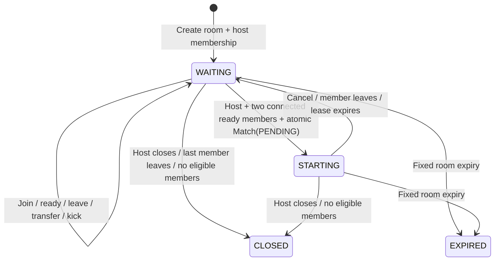

# Phase 3: presence, lobby, and room operations

TwoPlayer now supports authenticated users and server-issued guests creating public/private Nightfall Protocol rooms, sharing invites, joining, becoming Ready, transferring hosting, removing members, leaving, closing, and reserving/cancelling preparation. No gameplay or matchmaking is implemented.

## Architecture and ownership

The existing Next.js 16.3.4 / React 19 / Prisma 6 PostgreSQL stack is retained. No npm dependency was added. `docs/design-system.md`, semantic tokens, Radix dialogs, and Lucide remain the visual foundation.

The Phase 1 `src/realtime` boundary is refined into `PresenceService`, `RoomService`, `RoomStateStore`, `RealtimePublisher`, `RealtimeSubscriber`, `ConnectionManager`, and `MatchSessionService`. The original broad allocation gateway remains compatible for future phases. UI imports application interfaces and an HTTP client, never a provider SDK or database client.

- **PostgreSQL:** room metadata, visibility, host, membership, readiness, removal tombstones, revision, bounded command receipts, expiry, and existing `Match` reservations. All room mutations run in serializable transactions with up to four attempts. Predicate conflicts protect capacity and single-active-room membership across Vercel instances.
- **Redis:** expiring online/lobby/room leases and rate-limit counters. No permanent presence model and no database write for a heartbeat. Redis is ephemeral infrastructure, not another realtime provider.
- **Ably:** scoped change notifications. The browser connects directly to Ably SSE; Vercel only performs short REST requests. Messages contain only a revision, never player data, room codes, or snapshots. Authorized HTTP snapshots remain the source of truth.
- **Browser:** connection state, subscriptions, pending commands, reconnect attempts, and the latest accepted snapshot. Older revisions and older observations of the same revision are discarded.

Ably's [official REST API](https://ably.com/docs/api/rest-api) and [SSE API](https://ably.com/docs/api/sse), and Upstash's [Redis REST API](https://upstash.com/docs/redis/features/restapi), were used. The REST integration uses existing `fetch`; no vendor SDK is spread through the app.

## Environment

Production:

```dotenv
DATABASE_URL=postgresql://<pooled-production-connection>
AUTH_MODE=database
NEXT_PUBLIC_APP_URL=https://<this-deployment-origin>
REALTIME_PROVIDER=ably
REALTIME_SERVER_API_KEY=<ably-app.key:secret>
UPSTASH_REDIS_REST_URL=https://<redis-rest-endpoint>
UPSTASH_REDIS_REST_TOKEN=<redis-rest-token>
```

Existing optional settings: `SESSION_COOKIE_NAME` (default `twoplayer_session`) and `SESSION_TTL_DAYS` (default 30). `REALTIME_SERVER_URL` is retained for compatibility but unused by the Ably adapter. Only `NEXT_PUBLIC_APP_URL` is public. Configure it separately for each preview/deployment origin; production mutations require an exact origin match.

The Ably server key needs publish and subscribe capabilities restricted to `tp:room:*` and `tp:browser:*`. Tokens returned to browsers permit **subscribe only on one authorized channel**, expire after at most five minutes, and never outlive the application session. A kicked member's existing token can receive only opaque invalidations until expiry; snapshot and token renewal authorization reject the removed member immediately.

Local development:

```powershell
$env:AUTH_MODE = 'development'
$env:REALTIME_PROVIDER = 'local'
$env:DATABASE_URL = ''
$env:NEXT_PUBLIC_APP_URL = 'http://localhost:3000'
npm run dev
```

Local auth, rooms, and presence use one Node process. They survive module reload through a shared global store, but a process restart clears all data and sessions. **This is not production storage or a multi-instance deployment strategy.** Local browser subscriptions refresh authoritative snapshots every four seconds; the test publisher supplies immediate in-process events. `127.0.0.1` is an explicitly permitted development origin for a second independent loopback cookie jar; it does not affect production.

## Database deployment

The repository previously had a schema but no migration history. The new Phase 2 baseline represents that existing schema exactly, so fresh databases can be provisioned and existing databases can adopt migrations without recreating data.

For an **existing Phase 2 database**, first verify it matches the baseline schema, then mark that baseline as already applied:

```powershell
npx prisma migrate resolve --applied 20260907000000_phase2_baseline
npx prisma migrate deploy
npm run db:generate
```

For a **fresh empty database**:

```powershell
npx prisma migrate deploy
npm run db:generate
```

Do not mark a baseline applied to an incompatible schema. No reset, force push, or data-loss option is required. The Phase 3 migration only adds:

- `Room.stateVersion`, nullable unique `Room.creationKey`, and JSON `Room.commandReceipts`.
- `RoomMember.removedAt` and `removalReason`, retaining membership tombstones for kicks and safe replay handling.
- A public room discovery index `(gameId, visibility, status, createdAt)`.

The existing code unique constraint and composite membership primary key remain. No heartbeat, gameplay, or statistics table is added. A reservation creates the existing `Match` with `PENDING`; cancellation marks it `ABORTED` in the same transaction.

Production must contain a `Game` row with slug `nightfall-protocol`, status `ACTIVE`, and `maxPlayers=2`. The application never silently creates or activates production catalog records. Existing DRAFT/maintenance/archived games are deliberately rejected. Local development provides the first-game metadata only; room/player counts always come from real local sessions.

## Lifecycle and presence



`STARTING` is the successfully reserved preparation placeholder. It never enters the pre-existing `IN_MATCH` status and never connects to a game server. A failed reservation transaction preserves the previous room and permits retry. Disconnect/cancellation aborts any reservation and resets readiness.

- Room lifetime: **two hours**, fixed from creation; invites expire with it.
- Presence lease: **45 seconds** since the latest server-validated heartbeat.
- Host grace: **30 additional seconds** after the lease becomes stale (75 seconds after the last heartbeat). During grace the slot and role remain, readiness is reset, and the member is shown as Reconnecting.
- After grace, stale members are removed. Hosting transfers by earliest eligible `joinedAt`, then stable user ID. A stale host cannot renew an expired membership; rejoining is a new membership with no inherited host privilege.
- Intentional host leave transfers immediately and cancels preparation. The last departure closes the room.
- Independent tabs contribute to the same identity lease and aggregate count. A tab leaving the route does not immediately evict a player from another tab; there is deliberately no unload-based removal.
- Platform heartbeats run every 15 seconds. Room refreshes renew a lease at most once per 14 seconds; local snapshots run every four seconds, managed transport has a 30-second snapshot fallback. Activity is always derived from verified membership, not a client presence label.
- Presence summaries expose aggregate Online and In lobby counts only. In game remains zero because this phase runs no game.

Cleanup is lazy and Vercel-compatible: room access, browser lists, current-room lookup, and validated heartbeats reconcile expiry and disconnects. Redis leases expire independently. No perpetual server process or Cron is required. An inactive room's durable status can remain WAITING until its next access, but expired/stale rooms are filtered before listing or joining.

## API and security

`GET /api/lobby?op=list&slug=...`, `op=room&code=...`, `op=ticket&code=...` (or `slug=...`), and `op=presence`; `POST /api/lobby?op=command` and `op=heartbeat`.

Commands: `create`, `join`, `ready`, `leave`, `close`, `kick`, `start`, `cancel`. Schemas reject unknown fields, so callers cannot supply host identity, role, status, or capacity. Game slug is resolved and checked against fresh server metadata. Only verified sessions/guests can create, join, or subscribe. Public room discovery is available to these identities; public aggregate presence needs no identity.

Room codes use cryptographic `randomInt`, eight characters from `ABCDEFGHJKMNPQRSTVWXYZ23456789`, case-insensitive normalization, and a unique constraint with collision retry. Spaces and hyphens are ignored. Codes are bearer invitations: anyone holding a valid private code and a valid session may join an available slot. Non-members cannot read private snapshots. Private join failures intentionally use one generic message; authorized members receive actionable closed/expired/kicked states.

Mutations require same-origin JSON, reject cross-site Fetch Metadata, and bound streamed request bodies to 4096 bytes. Responses are no-store. Every response includes an opaque request correlation ID. Application failure logs include only that ID and a typed code, never cookies, tokens, invite codes, database errors, or credentials. Room pages set `no-referrer` and no-index metadata. Hosting access logs should redact `/rooms/*` and API `code` query values if request URLs are retained.

Rate limits (Redis-atomic, fixed 60-second windows):

| Scope                                   |        Limit |
| --------------------------------------- | -----------: |
| Network                                 | 300 requests |
| Verified session                        | 180 requests |
| Create/join attempts per network        |  40 attempts |
| Create per identity                     |   5 attempts |
| Join per identity                       |  15 attempts |
| Code snapshot/token lookup per identity |  90 requests |

On Vercel, the network bucket uses the platform-supplied `x-vercel-forwarded-for` hashed on the server. Other forwarding headers are ignored. Local development shares a `local` network bucket. Redis failure fails room operations closed. Vercel Firewall / edge rate limits should additionally cover unauthenticated auth/session traffic; Phase 2 credential recovery and broader auth abuse policy remain outside this implementation.

All commands carry UUID request IDs. The server hashes the actor+request ID and command fingerprint. Creation has a permanent unique creation key; room commands retain the creation receipt and the latest 127 receipts. Member commands additionally require an authoritative expected revision, preventing old evicted commands from mutating a newer state. Duplicate joins are naturally idempotent while membership is valid. UI retries after uncertain network outcomes reuse the original request ID.

## Recovery, payloads, and UI

The connection manager reconnects with 1/2/4/8/16 second delays, then enters Failed with explicit retry. It renews provider tokens, rechecks the session, resubscribes, fetches current state, deduplicates refresh work, and disposes subscriptions/timers on unmount. While transport is connected, snapshots refresh at most every 30 seconds if a notification was missed. A terminal transport failure leaves explicit retry/navigation available and gates lobby commands. No optimistic ready state survives a rejected command.

The room browser stores its open-slot filter in the URL. Forms preserve entered codes after recoverable errors. Copy supports Clipboard API plus a selected, labeled fallback field. Destructive host and leave actions use the existing Radix confirmation dialog, focus return, escape/back controls, and live feedback. Text labels accompany readiness, connection, host, guest, lifecycle, and visibility. Semantic tokens, logical layout properties, existing reduced-motion rules, 44px controls, and responsive stacking are retained.

## Verification

See `phase-3-verification.md` for exact commands, results, responsive checks, and remaining environment limitations. `phase-3-files.md` lists the complete source changes. Automated PostgreSQL tests only run when `LOBBY_TEST_DATABASE_URL` points to an explicitly isolated database named `phase3_test`; normal tests skip them otherwise.
